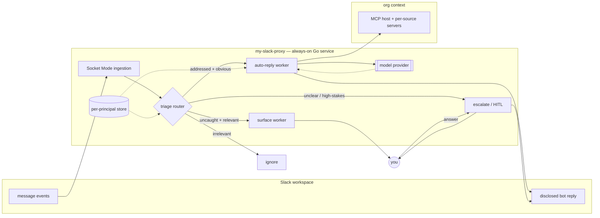

# 0001-my-slack-proxy — DESIGN

## Architecture

An always-on Go service holds a persistent outbound Socket Mode connection to the Slack workspace (no public inbound). Each inbound message for a connected principal is deduped and passed to a **triage router** (a cheap-model classifier) that dispatches it to exactly one of four fixed branches — ignore, auto-reply, surface, escalate — realizing the routing contract `SPEC#O-1-irrelevant-message-filtered` … `SPEC#O-4-unclear-or-high-stakes-message-escalated` and the exhaustiveness of `SPEC#INV-1-every-relevant-message-handled`. The auto-reply branch gathers org context through an MCP host (per-source servers for Confluence/Jira, GitHub, Workspace, Slack search), drafts with a capable model, and posts via the bot token — visibly an app, never the user. Surface and escalate branches reach you directly; an escalation holds all outbound until you answer, then executes your direction (`SPEC#O-5-escalation-resolved-per-user-direction`). Everything is scoped to a principal (tenant-aware; built single-tenant for v1). The model provider and org-source credentials are pluggable seams so the core stays org-agnostic and portable.

## Decision-1: routing-workflow-not-autonomous-agent
The proxy is a predefined **routing workflow**, not an autonomous agent loop: code owns the control flow (ingest → dedupe → classify → dispatch to one of four branches → on escalation, resume on your answer); the model decides only *within* a branch. Realizes `SPEC#O-1-irrelevant-message-filtered` … `SPEC#O-5-escalation-resolved-per-user-direction` and `SPEC#INV-1-every-relevant-message-handled`.
- Triage is a single classify-and-dispatch step over four distinct, non-overlapping branches.
- Model agency is confined to the auto-reply branch (`SPEC#O-2-obvious-direct-ask-auto-answered`): a bounded context-gathering + drafting tool-use loop with a step cap, never open-ended planning.
- Restraint is structural: anything uncertain or high-stakes routes to escalate, which holds outbound (the safety valve behind `SPEC#INV-1` and the requirement's "restraint over reach").
- See rationale at [design-rationale.md#Decision-1-routing-workflow-not-autonomous-agent].

## Decision-2: socket-mode-ingestion
Ingest Slack events over **Socket Mode** — a persistent outbound WebSocket — not the Events API. Needs no public HTTPS endpoint and no inbound firewall opening; realizes `SPEC#INV-8-continuous-observation` with auto-reconnect.
- Requires an app-level token (`xapp-`, `connections:write`) alongside the bot/user tokens.
- Event-driven by design: avoids polling `conversations.history`, which 2025 rate-limits throttle hard for non-Marketplace apps — the throttle makes polling a non-starter and confirms the event-stream choice.
- Reconnection handles periodic disconnect frames; a connection-health check backstops `SPEC#INV-8`.
- See rationale at [design-rationale.md#Decision-2-socket-mode-ingestion].

## Decision-3: user-token-read-bot-token-disclosed-post
Read each principal's surface with **their Slack user token** (`xoxp-`); post **only** with the **bot token** (`xoxb-`). Slack renders bot-token messages with an immutable **APP badge**, so disclosure (`SPEC#INV-2-output-always-disclosed`) is platform-enforced, not prompt-dependent.
- Read scopes: `channels:history`, `groups:history`, `im:history`, `mpim:history` + the `*:read` companions + `search:read`; the user token is what lets the proxy see uncaught-but-relevant messages a bot never could (`SPEC#O-3-uncaught-relevant-message-covered`).
- Disclosed posting = bot identity + thread reply (`thread_ts`) under the source message + "on behalf of @user" copy. Posting with a user token (true impersonation) is explicitly forbidden.
- See rationale at [design-rationale.md#Decision-3-user-token-read-bot-token-disclosed-post].

## Decision-4: mcp-context-adapter
"As informed as you" is realized by an **MCP host** running one pluggable client per org source (Confluence/Jira, GitHub, Google Workspace, Slack search). The agent speaks one protocol; each source is a swappable server exposing tools/resources. Realizes `SPEC#INV-7-context-grounded-actions` and keeps the core org-agnostic.
- Per-source credentials are scoped and isolated per principal — never shared across sources or tenants.
- v1 wires a minimal source set under least-scope, sandbox-first; sources are added behind the same seam.
- See rationale at [design-rationale.md#Decision-4-mcp-context-adapter].

## Decision-5: principal-scoped-store
A single **per-principal store** holds encrypted credentials (Slack user/refresh tokens, per-source secrets), the persona/relevance config, the voice/style profile, and processing state (dedupe ledger of handled message ts, escalation queue, surfaced log). Every row is principal-scoped — the tenant-isolation seam, built single-tenant for v1.
- v1: an embedded store (SQLite-class, pure-Go) with at-rest encryption; swappable for a managed store when multi-tenant.
- Slack token rotation (short-lived access + refresh) drives a per-principal refresh loop reading/writing this store.
- See rationale at [design-rationale.md#Decision-5-principal-scoped-store].

## Decision-6: pluggable-model-provider-with-tiered-routing
The LLM is reached through a **provider interface** (concrete provider deferred and gated on a socar-approved/zero-retention route); the triage classifier uses a **cheap** model and the drafter a **capable** one.
- Tiered routing is the main cost lever: most messages stop at cheap-model triage (ignore/surface), only acted-on messages pay for capable-model drafting.
- Egress minimization: only the content needed for the current decision crosses the provider boundary; a redaction pass strips obvious secrets/PII before send.
- Default v1 route = a direct provider API with retention/training disabled; swap to in-cloud Bedrock/Vertex when org-owned.
- See rationale at [design-rationale.md#Decision-6-pluggable-model-provider-with-tiered-routing].

## Decision-7: drafting-policy-and-voice-profile
A per-principal **voice/style profile** (few-shot exemplars mined from the principal's own Slack history + a short style descriptor) plus a fixed drafting policy drives every composed message. This single seam realizes the "how it speaks" invariants.
- `SPEC#INV-4-output-in-user-voice` — exemplars condition tone/style; `SPEC#INV-5-output-in-conversation-language` — draft in the detected language of the source thread.
- `SPEC#INV-3-plain-register-toward-user` — policy forbids honorifics/deference when referring to the principal; `SPEC#INV-6-business-appropriate-output` — professional-conduct policy.
- See rationale at [design-rationale.md#Decision-7-drafting-policy-and-voice-profile].

## Decision-8: eval-gates-for-quality-invariants
The probabilistic-quality invariants are verified by an **eval harness**, not unit tests: an offline LLM-as-judge suite scores drafts against the principal's real messages, plus online monitoring of routing decisions.
- Offline judges gate `SPEC#INV-4-output-in-user-voice`, `SPEC#INV-6-business-appropriate-output`, `SPEC#INV-7-context-grounded-actions` (judge aligned to held-out human labels before trust).
- Online metrics on `SPEC#INV-1` routing: false-filter rate (relevant message wrongly ignored) and escalation rate, surfaced for tuning.
- See rationale at [design-rationale.md#Decision-8-eval-gates-for-quality-invariants].

## Decision-9: always-on-single-service-deployment
Deploy as **one always-on Go container**, no public inbound (Socket Mode), provider-agnostic so it runs on any container host. Realizes the continuous-availability half of `SPEC#INV-8-continuous-observation`.
- Recommended v1 default: a lightweight always-on container host (mostly-idle workload); the cloud choice was left open and this keeps it a deployment-time swap, not a code change.
- A supervisor restarts the process and re-establishes the socket on failure; health is the `SPEC#INV-8` backstop.
- See rationale at [design-rationale.md#Decision-9-always-on-single-service-deployment].

## Decision-10: first-response-latency-budget
Pin `SPEC#INV-9-timely-first-response` at **p95 ≤ 15s to a triage decision** and **p95 ≤ 2 min to a first action** (reply posted, surfaced, or escalation raised), measured from event receipt and independent of your availability. The event-driven path (Decision-2) plus bounded triage make this attainable; the numbers are operational and tunable per workspace volume.

## Non-goals
- No work ordering, rollout, or admin-approval procedure here — those are TASK / your action items.
- No concrete model provider or cloud chosen yet — both are deliberately deferred behind their seams (Decision-6, Decision-9).
