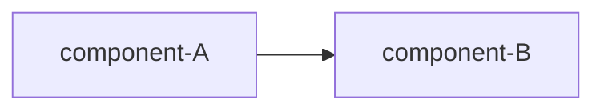

# 0001-my-slack-proxy — DESIGN

## Architecture

<!-- brief caption: what this diagram shows -->

<!-- Add Decision blocks below, each as:
##   Decision-<N>: <kebab-slug>
with a one-line WHAT and a one-line WHY (trivial) or a rationale anchor (non-trivial):
See rationale at [design-rationale.md#Decision-<N>-<slug>]. -->
