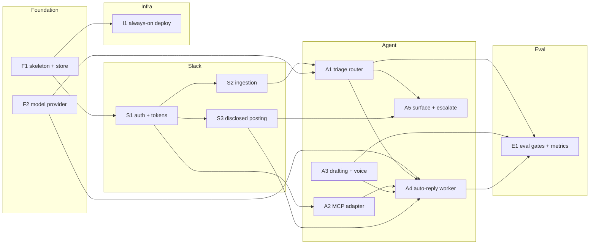

# 0001-my-slack-proxy — TASK

## Guidelines
- **Single-tenant v1.** Build the principal-scoped seam everywhere (per `DESIGN#Decision-5-principal-scoped-store`) but wire only one principal. Multi-tenant platform hardening (managed vault, audit, isolation verification) is a later feature — out of scope here.
- **Gated, sandbox-first org wiring.** Real org credentials/sources connect behind a least-scope, sandbox-first step pending the user's infosec/admin sign-off. Nothing org-specific is hardcoded — the core stays org-agnostic (`DESIGN#Decision-4-mcp-context-adapter`).
- **Egress discipline.** Minimize and redact what crosses the model-provider boundary (`DESIGN#Decision-6-pluggable-model-provider-with-tiered-routing`); the concrete provider stays a deferred, zero-retention-preferred config swap.

## Dependency DAG

Tracks: **F** foundation (runtime skeleton, persistence, model access), **S** Slack integration, **A** the agent decision flow, **I** infra/deployment, **E** evaluation. Edges are enablers — a prior task makes the next testable, not a hard gate.

## Task: F1
- **Goal**: Stand up the always-on Go service skeleton with a principal-scoped persistence layer (encrypted credentials, persona/config, voice profile, processing state) per `DESIGN#Decision-5-principal-scoped-store` — the seam every other task plugs into. Built single-tenant per the v1 guideline.
- **Repo**: my-slack-proxy
- **Completion**:
  - Service boots, opens and migrates the store; a round-trip writes and reads back an encrypted credential and a state record for one principal.
  - Stored secrets are unreadable at rest without the service key (inspect the on-disk store).
- **Dependencies**: none

## Task: F2
- **Goal**: Provide LLM access behind a pluggable provider interface with tiered cheap/capable routing and a pre-send redaction pass, per `DESIGN#Decision-6-pluggable-model-provider-with-tiered-routing` — so the concrete model is a config swap and egress is minimized.
- **Repo**: my-slack-proxy
- **Completion**:
  - A triage-class call routes to the cheap model and a draft-class call to the capable model, verifiable from provider-call logs.
  - Swapping the configured provider requires no code change (config-only).
  - The redaction pass strips seeded secret/PII markers from a sample payload before send.
- **Dependencies**: F1

## Task: S1
- **Goal**: Implement Slack app authorization — per-principal user-token OAuth grant, the shared bot token, and the app-level token — plus the token-rotation refresh loop, per `DESIGN#Decision-3-user-token-read-bot-token-disclosed-post` (read/identity half) and `DESIGN#Decision-5-principal-scoped-store`. Least-scope, sandbox-first per the gated-wiring guideline.
- **Repo**: my-slack-proxy
- **Completion**:
  - A principal completes the OAuth grant; user, bot, and app tokens are persisted (F1 store) and usable.
  - A rotated (expired) access token is transparently refreshed before an API call; no manual re-auth.
- **Dependencies**: F1

## Task: S2
- **Goal**: Ingest Slack events over a persistent Socket Mode connection with a dedupe ledger and auto-reconnect, per `DESIGN#Decision-2-socket-mode-ingestion` — the no-public-inbound, continuous intake that feeds triage and underwrites `SPEC#INV-8-continuous-observation`.
- **Repo**: my-slack-proxy
- **Completion**:
  - With no inbound port open, messages in the principal's channels/DMs arrive as events end-to-end.
  - A forced socket disconnect auto-reconnects with no missed or duplicated message (dedupe ledger holds), evidencing `SPEC#INV-8-continuous-observation`.
- **Dependencies**: S1

## Task: S3
- **Goal**: Post replies as a disclosed agent via the bot token — thread reply + "on behalf of @user" copy — per `DESIGN#Decision-3-user-token-read-bot-token-disclosed-post`, realizing `SPEC#INV-2-output-always-disclosed`. Never post with a user token.
- **Repo**: my-slack-proxy
- **Completion**:
  - A posted message renders with Slack's APP badge and threads under the source message; `SPEC#INV-2-output-always-disclosed` holds for every send path (no code path uses a user token to post).
- **Dependencies**: S1

## Task: A1
- **Goal**: Build the triage router — a cheap-model classifier that maps each ingested message to exactly one of ignore / auto-reply / surface / escalate, per `DESIGN#Decision-1-routing-workflow-not-autonomous-agent`. Realizes `SPEC#O-1-irrelevant-message-filtered`, `SPEC#O-2-obvious-direct-ask-auto-answered`, `SPEC#O-3-uncaught-relevant-message-covered`, `SPEC#O-4-unclear-or-high-stakes-message-escalated`, and the exhaustiveness of `SPEC#INV-1-every-relevant-message-handled`.
- **Repo**: my-slack-proxy
- **Completion**:
  - Fixture messages for each class route to the matching branch; an irrelevant message produces no outbound and no user notification (`SPEC#O-1-irrelevant-message-filtered`).
  - Every relevant fixture resolves to exactly one of reply / surface / escalate — none dropped (`SPEC#INV-1-every-relevant-message-handled`).
- **Dependencies**: S2, F2

## Task: A2
- **Goal**: Build the MCP context adapter — an MCP host running one pluggable, per-principal credential-isolated client per org source — per `DESIGN#Decision-4-mcp-context-adapter`, the realization of `SPEC#INV-7-context-grounded-actions`. Sandbox-first per the gated-wiring guideline.
- **Repo**: my-slack-proxy
- **Completion**:
  - The agent retrieves context from at least one wired source through the adapter; adding/removing a source is config-only.
  - One principal's client cannot read another's credentials or data (isolation check, single-tenant-asserted now).
- **Dependencies**: S1

## Task: A3
- **Goal**: Implement the drafting policy and per-principal voice/style profile (exemplars mined from the principal's own history + style descriptor), per `DESIGN#Decision-7-drafting-policy-and-voice-profile` — the single seam for how the proxy speaks. Realizes `SPEC#INV-4-output-in-user-voice`, `SPEC#INV-3-plain-register-toward-user`, `SPEC#INV-5-output-in-conversation-language`, and `SPEC#INV-6-business-appropriate-output`.
- **Repo**: my-slack-proxy
- **Completion**:
  - A draft for a fixture thread reads in the principal's style (eval-judged in E1), is in the thread's language (`SPEC#INV-5-output-in-conversation-language`), uses no honorific/deferential reference to the principal (`SPEC#INV-3-plain-register-toward-user`), and is workplace-appropriate.
- **Dependencies**: F2

## Task: A4
- **Goal**: Build the auto-reply worker — a bounded context-gather (via A2) → draft (via A3/F2) → disclosed post (via S3) loop with a step cap — per `DESIGN#Decision-1-routing-workflow-not-autonomous-agent`. Handles `SPEC#O-2-obvious-direct-ask-auto-answered` and the reply path of `SPEC#O-3-uncaught-relevant-message-covered`; grounds its reply in retrieved context (`SPEC#INV-7-context-grounded-actions`).
- **Repo**: my-slack-proxy
- **Completion**:
  - An obvious direct ask gets a posted, disclosed, context-grounded reply with no prior user involvement (`SPEC#O-2-obvious-direct-ask-auto-answered`).
  - The context-gather loop terminates at its step cap; a reply never contradicts retrieved context (`SPEC#INV-7-context-grounded-actions`, eval-judged in E1).
- **Dependencies**: A1, A2, A3, S3

## Task: A5
- **Goal**: Build the surface and escalate/HITL workers — surface an uncaught-relevant message to the principal, or ask via interactive controls and hold all outbound until answered, then execute the answer. Realizes the surface path of `SPEC#O-3-uncaught-relevant-message-covered`, `SPEC#O-4-unclear-or-high-stakes-message-escalated`, and `SPEC#O-5-escalation-resolved-per-user-direction`.
- **Repo**: my-slack-proxy
- **Completion**:
  - An uncaught-relevant message reaches the principal with context (`SPEC#O-3-uncaught-relevant-message-covered`).
  - A high-stakes/unclear message produces an ask and zero outbound until the principal answers (`SPEC#O-4-unclear-or-high-stakes-message-escalated`); on answer, the proxy sends/edits/drops exactly as directed (`SPEC#O-5-escalation-resolved-per-user-direction`).
- **Dependencies**: A1, S3

## Task: I1
- **Goal**: Package and run the service as one always-on container with a supervisor that restarts and re-establishes the socket on failure, no public inbound, provider-agnostic, per `DESIGN#Decision-9-always-on-single-service-deployment` — the availability half of `SPEC#INV-8-continuous-observation`.
- **Repo**: my-slack-proxy
- **Completion**:
  - dev: the container runs unattended; a killed process is restarted and re-observes within the recovery window.
  - prod: deployed to the chosen host with no inbound ports exposed; uptime/health monitored against `SPEC#INV-8-continuous-observation`.
- **Dependencies**: F1

## Task: E1
- **Goal**: Build the eval harness — offline LLM-as-judge gates plus online routing metrics — per `DESIGN#Decision-8-eval-gates-for-quality-invariants`, the verification home for the probabilistic-quality invariants and the latency budget.
- **Repo**: my-slack-proxy
- **Completion**:
  - Offline judges (aligned to held-out human labels first) score drafts and gate `SPEC#INV-4-output-in-user-voice`, `SPEC#INV-6-business-appropriate-output`, `SPEC#INV-7-context-grounded-actions` in CI.
  - Online metrics report false-filter rate and escalation rate for `SPEC#INV-1-every-relevant-message-handled`, and first-response latency against the `SPEC#INV-9-timely-first-response` SLO (p95 ≤ 15s triage, ≤ 2 min first action) per `DESIGN#Decision-10-first-response-latency-budget`.
- **Dependencies**: A1, A3, A4
