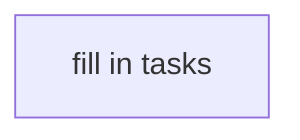

# 0001-my-slack-proxy — TASK

<!-- Doc-level Guidelines section is conditional — include only when feature-wide
work-stance rules genuinely apply (base branch, canary sequence, coordination). -->

## DAG

<!-- caption: what the tracks represent; 1-2 sentences. -->

<!-- Add Task cards below, each as:
##   Task: <track-prefix><N>
- **Goal**: <WHAT + HOW; inline SPEC#O-<N>-<slug> / SPEC#INV-<N>-<slug> / DESIGN#Decision-<N>-<slug> anchors>
- **Repo**: <path or repo name>
- **Completion**: <observable verification, cites SPEC anchors>
- **Dependencies**: <prior task IDs as enablers | none>
- **Guidelines** (conditional): <task-level work-stance rules>
-->
